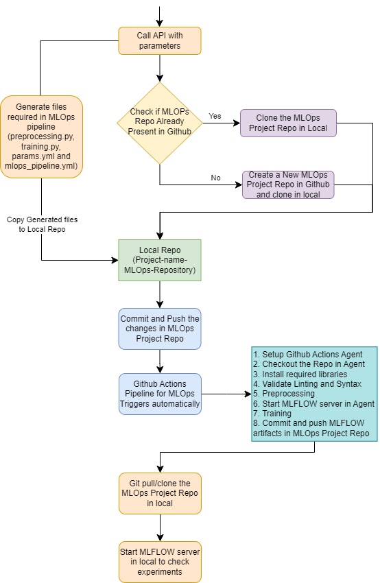

python preprocessing.py --config="params.yml" --input_csv="C:\Users\A715809\Downloads\Iris.csv"  --training_columns="SepalLengthCm,SepalWidthCm,PetalLengthCm,PetalWidthCm" --target_column="Species" 

python training.py --config="params.yml" --input_csv="C:\Users\A715809\Downloads\Iris.csv" --model_path "C:\Users\A715809\Projects\MLOPs\onprem_assisted_mlops\model.joblib" --training_columns="SepalLengthCm,SepalWidthCm,PetalLengthCm,PetalWidthCm" --target_column="Species" --train_size=0.80

python preprocessing.py --config="params.yml" --input_csv="data/source/Iris.csv"  --training_columns="SepalLengthCm,SepalWidthCm,PetalLengthCm,PetalWidthCm" --target_column="Species" 

python training.py --config="params.yml" --input_csv="data/processed/iris_train.csv" --model_path "prediction_service/model/model.joblib" --training_columns="SepalLengthCm,SepalWidthCm,PetalLengthCm,PetalWidthCm" --target_column="Species" --train_size=0.80

#### mlflow server command -
mlflow server --backend-store-uri sqlite:///mlflow.db --default-artifact-root ./artifacts --host 127.0.0.1 -p 1234

